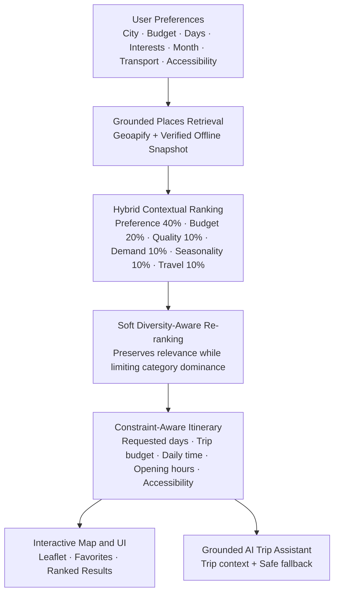

# Adaptive AI Tourism Planner for Saudi Arabia

An AI-powered Saudi tourism planning platform that creates personalized, context-aware itineraries using grounded place data, machine learning demand forecasting, hybrid recommendation ranking, seasonality, user preferences, and interactive mapping.

---

## Overview

### The Problem
- **Generic Travel Recommendations:** Mainstream travel tools produce uniform, one-size-fits-all suggestions that fail to capture authentic local diversity.
- **Dynamic Demand Shifts:** Tourism patterns across the Kingdom shift significantly by city, season, and major cultural calendars.
- **Diverse Traveler Constraints:** Travelers have distinct personal interests, budgets, mobility/wheelchair accessibility requirements, and time durations that rigid static itineraries cannot accommodate.

### The Solution
The **Adaptive AI Tourism Planner** delivers:
- **Personalized Saudi Itineraries:** Fully tailored schedules adapting to traveler budget, duration, transport preference, and accessibility needs.
- **Grounded Venue Recommendations:** Authentically sourced attractions, restaurants, and cafés backed by verified coordinates and transparent provenance.
- **Context-Aware Ranking:** Recommendations infused with regional macroeconomic demand and provincial seasonality indicators.
- **Interactive Mapping:** Interactive Leaflet maps with bi-directional synchronization, card focus, marker popups, and bookmark visualization.
- **AI Trip Assistant:** In-app grounded conversational assistant providing context-aware guidance with zero fabricated information.
- **Trip Persistence & Bookmarks:** Persistent trip history and favorites management across browser sessions.

---

## Key Features

- **Personalized Trip Planning:** Customized multi-day plans generated based on city, budget, duration (1–14 days), transport mode, and travel month.
- **Ranked Recommendations:** Candidate places scored and presented across dedicated category tabs:
  - 📍 **Attractions** (Culture, Heritage, Nature, Adventure)
  - 🍽️ **Restaurants** (Local and international cuisine)
  - ☕ **Cafés** (Cafés and relaxation spots)
- **Diversity-Aware Re-ranking:** Balanced category representation ensuring diverse venue types appear without one category dominating.
- **Interactive Leaflet Map:** Synchronized map view displaying verified pins, category badges, and active route markers.
- **Card ↔ Map Synchronization:** Clicking a card centers and highlights its map pin; clicking a pin focuses the card.
- **Expandable Map:** Responsive full-view modal map for immersive spatial exploration on Results, Trending, and Favorites pages.
- **AI Trip Assistant:** Conversational travel assistant operating with verified trip context and fallback safety.
- **Persistent Chat Session:** Assistant history retained across page navigation.
- **Trip History:** Automatic local saving and browsing of past generated itineraries in "My Trips".
- **Favorites & Bookmarks:** Instant bookmarking of venues with dedicated `/favorites` management page and map filtering.
- **Local Demo Authentication:** Lightweight profile management with interest preferences, transport selection, and accessibility defaults.
- **Trending Destinations:** Curated national destination highlights ranked with transparent contextual demand signals.
- **Safe Image Resolver:** Multi-tiered venue image pipeline (curated registry, Google Places, verified Wikipedia search) with clean fallback placeholders and zero broken icons.
- **Estimated Cost Labels:** Truthful `Est.` price tags preventing deceptive claims of exact live venue menus.
- **Multi-City Support:** Covers 8 major tourism hubs across Saudi Arabia:
  - **Riyadh**
  - **Abha**
  - **Dammam**
  - **Tabuk**
  - **Jeddah**
  - **Makkah**
  - **Madinah**
  - **AlUla**

---

## AI & ML Architecture

The architecture maintains a strict, mathematically grounded separation between macro-level demand forecasting and venue-level recommendation ranking:

```
┌─────────────────────────────────────────────────────────────────────────┐
│                        AI & ML ARCHITECTURE                             │
├───────────────────────────────────┬─────────────────────────────────────┤
│   1. CITY DEMAND FORECASTING      │   2. HYBRID RECOMMENDATION RANKING  │
│   (Macro Econometric Model)       │   (Venue Selection & Diversity)     │
│                                   │                                     │
│   • Extra Trees Regressor         │   • Preference Match: 40%           │
│   • Target: 1-month-ahead city    │   • Estimated Budget Fit: 20%       │
│     total POS transaction value   │   • Place / Data Quality: 10%       │
│   • Evaluated on holdout &        │   • Regional Demand:  10%           │
│     rolling-origin folds          │   • Seasonality:      10%           │
│   • DOES NOT rank venues          │   • Travel Fit:       10%           │
│                                   │   • Soft diversity-aware reranking  │
└───────────────────────────────────┴─────────────────────────────────────┘
```

### 1. City Demand Forecasting
- **Model:** Extra Trees Regressor (`n_estimators=300`, `min_samples_leaf=2`, `max_features=1.0`).
- **Objective:** Forecasts one-month-ahead total Point-of-Sale (POS) transaction volume for Saudi cities using historical KAPSARC macroeconomic data.
- **Validation Methodology:** Evaluated via 3 rolling-origin validation folds (primary metric MAE) plus an untouched final 12-month holdout (July 2024 through June 2025).
- **Verified Metrics (Untouched Final Holdout):**
  - **R² Score:** `0.9803`
  - **Mean Absolute Percentage Error (MAPE):** `6.88%`
  - **Mean Absolute Error (MAE):** `316,147.93 thousand SAR`
  - **Root Mean Squared Error (RMSE):** `791,073.74 thousand SAR`
  - **Seasonal-Naive Baseline MAE:** `448,356.71 thousand SAR`
  - **MAE Improvement vs Baseline:** `+29.49%`

> [!NOTE]
> The Extra Trees model forecasts aggregate city-level economic demand. It does **not** score or rank individual restaurants, cafés, or attractions.

### 2. Hybrid Contextual Recommendation Ranking
Candidate venues in the selected city are evaluated and scored using six transparent, grounded signals (summing to 1.00):

$$\text{Score} = 0.40 \cdot \text{Pref} + 0.20 \cdot \text{Budget} + 0.10 \cdot \text{Quality} + 0.10 \cdot \text{Demand} + 0.10 \cdot \text{Season} + 0.10 \cdot \text{Travel}$$

$$\begin{aligned}
\text{Score} = &\; 0.40 \times \text{Preference Match} \\
&+ 0.20 \times \text{Estimated Budget Fit} \\
&+ 0.10 \times \text{Place Quality} \\
&+ 0.10 \times \text{Regional Demand} \\
&+ 0.10 \times \text{Seasonality} \\
&+ 0.10 \times \text{Travel Fit}
\end{aligned}$$

1. **User Preference Match (40%):** Keyword overlap between traveler interests and venue categories/tags.
2. **Estimated Budget Fit (20%):** Evaluates how well a venue's estimated cost fits within the trip's per-stop budget allowance (`estimated_per_stop_allowance = budget / (days * EXPECTED_STOPS_PER_DAY)`). Category-level estimated costs are used (Café ≈ 35 SAR, Attraction ≈ 50 SAR, Restaurant ≈ 80 SAR); these are explicitly labeled as **estimates**, not live venue menus or verified venue prices.
3. **Place / Data Quality (10%):** Completeness and verification level of venue metadata (verified coordinates, address, accessibility evidence). It is record/data quality, **not** a user rating.
4. **Regional Demand Context (10%):** City POS transaction baseline combined with national tourism-sector transaction velocity from KAPSARC datasets.
5. **Provincial Seasonality (10%):** Monthly hotel accommodation occupancy rates from official DataSaudi provincial indices.
6. **Transport-Aware Travel Fit (10%):** Transport mode-aware (walking, public transit, driving) travel feasibility and distance fit relative to city center.

**Constraints & Non-Ranking Parameters:**
- **City is NOT a ranking weight:** City controls candidate filtering, city demand context, and geographic reference coordinates.
- **Days are NOT a fake ranking weight:** Days directly determine expected trip capacity, candidate retrieval pool size (`top_n = max(12, days * 4)`), per-stop budget allowance, budget fit, and multi-day itinerary pacing.
- **Accessibility is a hard evidence-based constraint:** When strict mode is requested, places without confirmed accessibility are excluded.
- **Opening hours are constraints:** Enforced during itinerary scheduling when confirmed data exists.

**Soft Diversity-Aware Re-ranking:**
Following candidate scoring, the engine applies soft diversity-aware re-ranking with a deterministic category-repeat penalty (`DIVERSITY_REPEAT_PENALTY = 0.06`). The engine first computes the hybrid contextual ranking score, then applies the repeat penalty to subsequent venues in the same category during re-ranking. This prevents a single category from monopolizing results while preserving genuine relevance. It does **not** enforce a rigid round-robin, fixed quotas (e.g. 4 attractions / 4 restaurants / 4 cafes), or guaranteed equal category counts.

> [!IMPORTANT]
> The source datasets provide city-total POS transactions and national sector-total transactions as separate series. The system never fabricates an unobserved "city $\times$ sector" cross-product.

---

## Recommendation Flow



---

## System Architecture

```
┌────────────────────────────────────────────────────────────────────────┐
│                        SYSTEM ARCHITECTURE                             │
└────────────────────────────────────────────────────────────────────────┘

 [Frontend Client]
 React 18 + TypeScript + Tailwind CSS + Vite
   │
   ├── Page Routing (React Router v6)
   ├── Interactive Maps (React-Leaflet / OpenStreetMap)
   ├── Client Storage (localStorage for Auth, Trips, Favorites)
   └── Floating AI Assistant Interface
         │
         ▼ HTTP REST (JSON)
 [Backend API]
 FastAPI (Python 3.12, Uvicorn)
   │
   ├── GET  /health
   ├── GET  /model-info
   ├── POST /predict-demand
   ├── POST /plan-trip ───────────────────┐
   ├── GET  /api/dashboard/trending-places ▼
   └── POST /assistant/chat            [Hybrid Engine]
         │                             ├── Feature Engineering (Pandas, NumPy)
         ▼                             ├── Extra Trees Regressor (.joblib)
   [Trip Assistant]                    ├── KAPSARC City & Sector Monthly Features
   ├── Grounded Context Injector       ├── DataSaudi Provincial Seasonality
   ├── Groq API (LLaMA-3) [Optional]   ├── Places API + Curated Snapshot Cache
   ├── Anthropic Claude [Optional]     └── Safe Wikipedia/Wikimedia Image Resolver
   └── Deterministic Rule Engine          │
                                       ▼
                                       [Itinerary Optimizer]
                                       Constraint-aware cumulative budget pacing
```

---

## Technology Stack

### Frontend
- **Framework:** React 18 with TypeScript
- **Styling:** Tailwind CSS (Custom palette: Sand, Palm, Dune, Rock, Ink)
- **Build Tool:** Vite
- **Navigation:** React Router v6
- **Mapping:** Leaflet & React-Leaflet with OpenStreetMap tiles
- **Icons:** Lucide React

### Backend
- **Language & Runtime:** Python 3.12
- **Web Framework:** FastAPI with Uvicorn ASGI
- **Data Manipulation:** Pandas, NumPy
- **Machine Learning:** scikit-learn, joblib
- **HTTP Client:** Requests

### AI / ML & External Data
- **Forecasting:** Extra Trees Regressor
- **Context Sources:** KAPSARC Macroeconomic Data, DataSaudi Tourism Statistics
- **Grounded Places:** Geoapify Places API with curated offline snapshot fallback
- **Image Pipeline:** Curated Landmark Registry, Wikipedia PageImages API
- **Assistant:** Grounded prompt injection via Groq / Claude with deterministic rule-based fallback

### Persistence
- **Client Session:** `localStorage` persistence for local demo authentication, saved trips, favorites, and assistant dialogs.

---

## Project Structure

```
Adaptive-AI-Tourism-Planner/
├── README.md                                 # Root project documentation
├── .gitignore                                # Git ignore rules
├── VERIFICATION_REPORT.md                   # Independent ML & data verification report
├── FINAL_REPORT_TECHNICAL_CORRECTIONS.md     # Architectural corrections log
├── SHA256SUMS.txt                            # Checksums for production ML artifacts
│
├── saudi-trip-planner-frontend/              # React + TypeScript + Tailwind web client
│   ├── src/
│   │   ├── components/                       # UI components (TripMap, PlaceCard, Header, etc.)
│   │   ├── pages/                            # Plan, Results, Trending, Favorites, MyTrips, Profile
│   │   ├── lib/                              # API client, context, auth, favorites service
│   │   ├── main.tsx                          # App root & route registration
│   │   └── index.css                         # Design system tokens & Tailwind imports
│   ├── package.json
│   └── vite.config.ts
│
├── saudi-trip-planner-backend/               # FastAPI backend & ML scoring engine
│   ├── main.py                               # FastAPI application & API route handlers
│   ├── ml_engine.py                          # Core ML recommendation, scoring & assistant engine
│   ├── ml_artifacts/                         # Deployed Extra Trees model & context feature tables
│   ├── tourism_app_data/                     # Raw datasets & verified places snapshot
│   ├── tests/                                # Backend unit & integration test suite
│   ├── requirements.txt                      # Production runtime dependencies
│   └── requirements-dev.txt                  # Test & development tooling
│
├── ML/                                       # Production ML training pipeline & notebooks
│   ├── Saudi_Tourism_AI_ML_Production_Pipeline.ipynb  # Self-contained training notebook
│   └── verified_outputs/                     # Holdout metrics, validation summaries & logs
│
├── tests/                                    # Root frontend contract regression tests
│   └── test_frontend_contract.py             # Contract tests verifying UI integrity
│
└── docs/                                     # Technical documentation & design plans
```

---

## Running Locally

### Prerequisites
- Python 3.10+ (Python 3.12 recommended)
- Node.js 18+ and npm

### 1. Backend Setup

```bash
# Navigate to the backend directory
cd saudi-trip-planner-backend

# Create and activate a virtual environment
python -m venv .venv

# On Windows:
.venv\Scripts\activate

# On macOS/Linux:
# source .venv/bin/activate

# Install runtime dependencies
pip install -r requirements.txt

# Start the development server
uvicorn main:app --host 0.0.0.0 --port 8000 --reload
```

- API Base URL: `http://localhost:8000`
- Interactive Swagger Documentation: `http://localhost:8000/docs`
- Health Check: `http://localhost:8000/health`

### 2. Frontend Setup

```bash
# Open a new terminal and navigate to the frontend directory
cd saudi-trip-planner-frontend

# Install dependencies
npm ci

# Configure environment variables
# Copy .env.example to .env
cp .env.example .env

# Verify that VITE_API_BASE is set:
# VITE_API_BASE=http://localhost:8000

# Start the Vite development server
npm run dev
```

- Web Application: `http://localhost:5173`

---

## Testing & Quality Assurance

### Run Backend Tests

```bash
cd saudi-trip-planner-backend
.\.venv\Scripts\python.exe -m pytest -q
.\.venv\Scripts\python.exe -m compileall -q -x "\.venv" .
```

*Status:* **49 passed** across unit, integration, ML engine, and itinerary days distribution suites.

### Run Root Contract Tests

```bash
# From repository root
.\saudi-trip-planner-backend\.venv\Scripts\python.exe -m pytest tests -q
```

*Status:* **18 passed** verifying requested day tabs, empty-day messaging, "Estimated travel" route labeling, category chips, favorites mapping, details modal, and elimination of raw coordinate/method strings.

### Build Frontend for Production

```bash
cd saudi-trip-planner-frontend
npm run build
```

*Status:* **Successful** (`dist/` bundle compiled in ~11s with zero TypeScript errors, 1914 modules transformed).

---

## Data Integrity & Grounding Guarantees

1. **No Synthetic Venues:** All destinations originate from real-world OpenStreetMap / Geoapify records or curated historical landmarks.
2. **Zero Fabricated Ratings:** The application does not present synthetic star ratings or invented user reviews.
3. **Transparent Price Modeling:** Specific venue item prices are marked with `Est.` to denote category-level averages rather than live menu pricing.
4. **Faithful Accessibility:** Accessibility is strictly marked as `Confirmed` only when verified; unconfirmed places remain `Unknown`.
5. **Realistic Routing:** Distance calculations use Haversine formulas adjusted by documented road curvature factors rather than deceptive simulated traffic.
6. **No Broken Media:** Unresolved photos fall back to clean SVG placeholders rather than broken image icons or unrelated generic photos.
7. **Offline Snapshot Resilience:** If upstream live venue APIs experience transient outages or rate limits, the system automatically falls back to verified offline snapshot records without dropping categories.

---

## Team

**Team 8 — Insights Innovators**  
Samsung Innovation Campus Capstone Project

---

## Academic & Project Context

- **Program:** Samsung Innovation Campus
- **Deliverable:** Final Capstone Project
- **Project Title:** Adaptive AI Tourism Planner for Saudi Arabia
- **Target Audience:** Saudi Vision 2030 domestic and international travelers seeking culturally authentic, context-aware itineraries.
